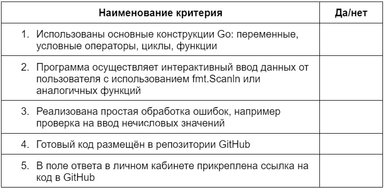
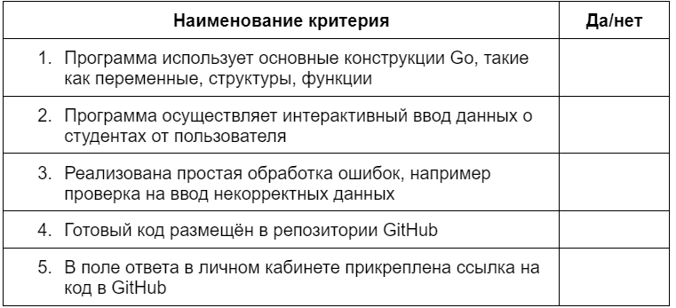
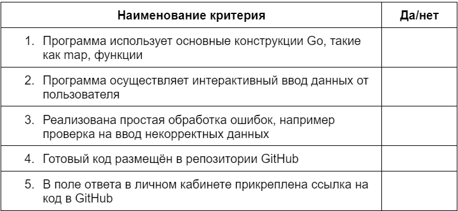
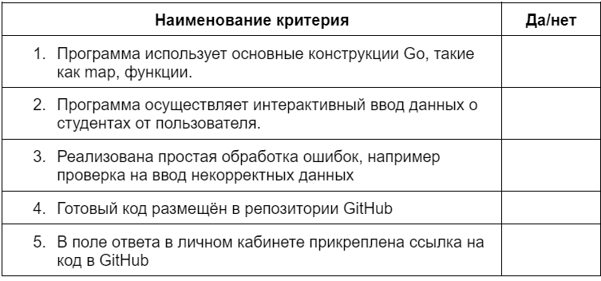

# Домашнее задание 3

[Вернуться на Главную страницу](../../../README.MD)

Дисциплина: Программирование на Golang

Тема 3. Функции и пакеты
Тема 4. Типы данных в GO: array, sliсe, map

Цель задания:

Научиться применять полученные знания на практике: решать учебные задачи, используя функции, типы и структуры данных в Golang

## Описание задания 1

Задача: написать программу, которая принимает строку от пользователя и создаёт слайс, содержащий каждый символ этой строки.
Требования

    Программа должна запрашивать ввод строки от пользователя.
    Строка может содержать любые символы, включая пробелы и специальные символы.
    Программа должна создавать слайс, содержащий каждый символ строки в порядке их появления.
    Слайс должен быть выведен на экран.
    Требования к выводу на экран: программа должна вывести полученный слайс на экран в удобочитаемом формате.

Пример работы программы

    Программа предлагает ввести строку.
    Пользователь вводит, например, «Hello, World!»
    Программа создаёт слайс, содержащий каждый символ строки: [‘H’, ‘e’, ‘l’, ‘l’, ‘o’, ‘,’, ’ ', ‘W’, ‘o’, ‘r’, ‘l’, ‘d’, ‘!’].
    Слайс выводится на экран.

**Чек-лист самопроверки**

## Описание задания 2

Задача: создать структуру для представления информации о студентах (имя, возраст, оценки и т. д.). Реализовать функцию, которая добавляет студентов в слайс и выводит список студентов.
Требования

    Программа должна содержать структуру Student, представляющую информацию о студентах: имя, возраст, оценки и т. д.
    Программа должна реализовать функцию, которая добавляет студентов в слайс.
    Программа должна реализовать функцию, которая выводит список студентов.

Пример работы программы

    Программа предоставляет пользователю возможность добавить информацию о студенте: имя, возраст, оценки.
    Пользователь имеет возможность добавить информацию о нескольких студентах.
    Программа выводит список всех студентов и информацию о них.

**Чек-лист самопроверки**

## Описание задания 3

Задача: создать map для хранения перевода слов с одного языка на другой. У пользователя должна быть возможность добавлять и искать переводы.
Требования

    Программа должна содержать map для хранения переводов, где ключом будет слово на одном языке, а значением его перевод на другой язык.
    Программа должна реализовать функцию для добавления новых переводов в map.
    Программа должна реализовать функцию для поиска перевода по введённому слову.

Пример работы программы

    Программа предоставляет пользователю возможность добавить новый перевод: пользователь вводит слово на одном языке и его перевод на другом.
    У пользователя есть возможность добавить несколько переводов.
    Программа предоставляет пользователю возможность искать перевод введенного слова и вывода перевода на экран.

**Чек-лист самопроверки**

 
## Описание задания 4

Задача: используйте map, чтобы учитывать количество студентов по каждому курсу в университете.
Требования

    Программа должна использовать map, чтобы учитывать количество студентов по каждому курсу.
    Реализовать функцию, которая добавляет новых студентов в map с указанием курса.
    Реализовать функцию, которая позволяет получить общее количество студентов по каждому курсу.

Пример работы программы

    Программа должна предоставить пользователю возможность добавлять новых студентов, указывая их курс.
    Пользователь может добавить несколько студентов на разные курсы.
    Программа должна предоставить возможность вывести общее количество студентов по каждому курсу.

**Чек-лист самопроверки**

