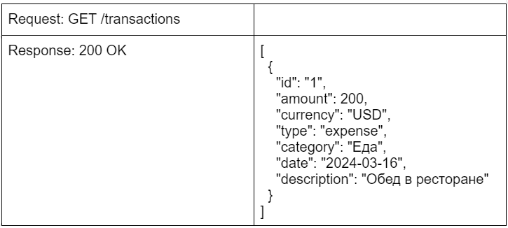
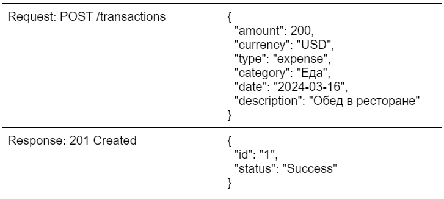
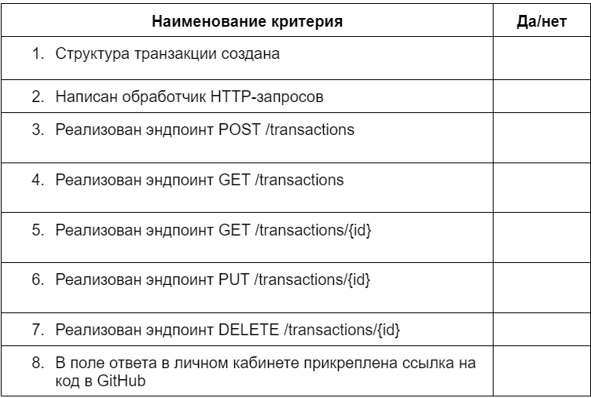

# Домашнее задание 5

[Вернуться на Главную страницу](../../../README.MD)

Дисциплина
Программирование на Golang
Тема 7.Создание RESTful API на Golang

## Описание задания

Реализуйте веб-сервис обработки транзакций. Транзакция должна включать в себя информацию о сумме, валюте, типе (доход/расход), категории, дате и описании транзакции.

### Шаг 1. Определите структуру транзакции:
ID
сумма
валюта: USD, EUR и т. д.
тип: доход, расход или перевод
категория: зарплата, еда, жильё и т. д.
дата
описание
### Шаг 2. Запустите веб-сервер с помощью метода http.ListenAndServe() и реализуйте обработчик входящих запросов.

### Шаг 3. Разработайте следующие эндпоинты:
создание транзакции: POST /transactions;
получение списка всех транзакций: GET /transactions;
получение одной транзакции по ID: GET /transactions/{id};
обновление транзакции по ID: PUT /transactions/{id};
удаление транзакции по ID: DELETE /transactions/{id}.

### Шаг 4. Проведите тестирование с использованием Postman или cURL.
Примечание
Разработайте структуру вашего API так, чтобы его можно было легко расширить в будущем. Используйте принципы RESTful для создания чистого и понятного API.

## Пример работы программы
---
### Создание транзакции:

### Получение списка транзакций:

## Чек-лист самопроверки:

