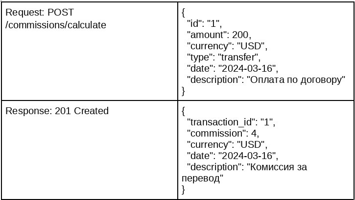
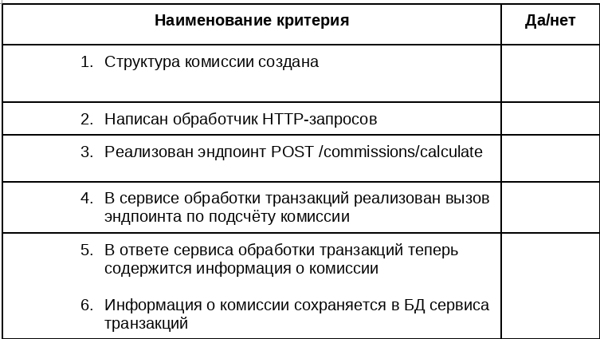

Домашнее задание 7

[Вернуться на Главную страницу](../../../README.MD)

Дисциплина	Программирование на Golang

## Тема	Тема 1–8

Цель этого задания — создать веб-сервис, который будет отвечать за расчёт комиссий для транзакций. Комиссия может зависеть от различных параметров, таких как сумма транзакции, валюта, тип и категория транзакции.

### Шаг 1. Определите структуру комиссии:

● ID транзакции;
● сумма транзакции;
● валюта транзакции: USD, EUR и т. д.;
● тип транзакции: доход, расход или перевод;
● комиссия: процент или фиксированная сумма, зависит от правил расчёта;
● дата расчёта;
● описание комиссии.

### Шаг 2. Запустите веб-сервер.

Используйте метод http.ListenAndServe(), чтобы запустить веб-сервер и реализовать обработчик входящих запросов.

### Шаг 3. Разработайте эндпоинты.

Расчёт комиссии для транзакции: POST /commissions/calculate — принимает данные о транзакции и возвращает расчёт комиссии. Реализуйте подсчёт по своему желанию. Пример, как можно реализовать эту функцию:
● Если транзакция имеет type == перевод и валюта == USD, то комиссия составит 2% в валюте самой транзакции. (commission := req.Amount * 0.02)
● Если транзакция имеет type == перевод и валюта == RUB, то комиссия составит 5% в валюте самой транзакции. (commission := req.Amount * 0.05)
● Если транзакция имеет type == покупка или пополнение, то комиссию рассчитывать не надо.

### Шаг 4. Интеграция с сервисом обработки транзакций.

Модификация сервиса обработки транзакций:
● добавьте вызов эндпоинта /commissions/calculate после создания или обновления транзакции, чтобы рассчитать комиссию;
● сохраните информацию о сумме комиссии в базе данных сервиса транзакций (ДЗ 6).

**Пример отправки запроса из сервиса транзакций (ДЗ 6):**

```json
// Создайте новый HTTP-запрос
// requestBody — структура вашего запроса в JSON-форматеreq, err := http.NewRequest(“POST”, “http://localhost:8081/commissions/calculate”, bytes.NewBuffer(requestBody))
if err != nil {
return nil, err
}

req.Header.Set(“Content-Type”, “application/json”)

// Отправьте запрос
client := &http.Client{}
resp, err := client.Do(req)
if err != nil {
return nil, err
}
defer resp.Body.Close()
// Затем прочитайте и декодируйте ответ из resp
``` 

### Пример работы программы

**Создание транзакции:**



**Чек-лист самопроверки**



