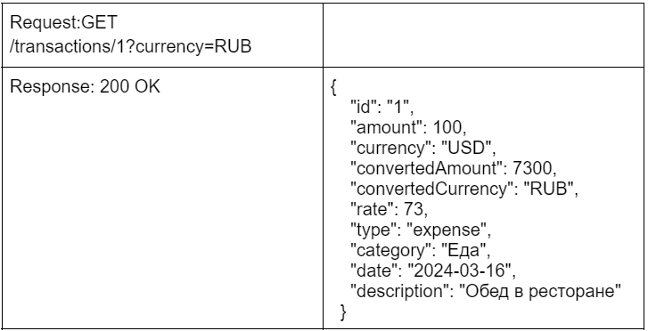
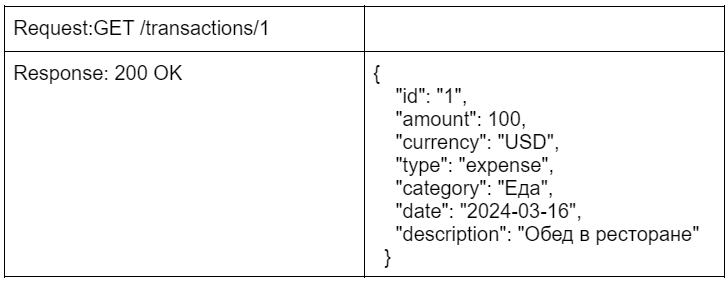
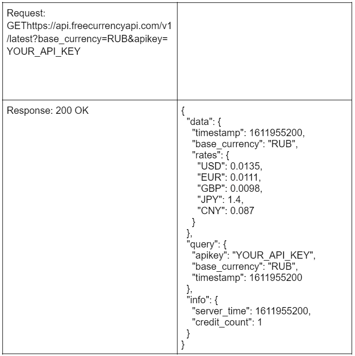
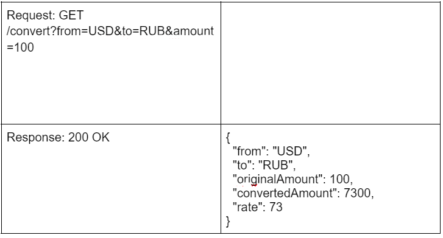

Домашнее задание 8

[Вернуться на Главную страницу](../../../README.MD)

Дисциплина	Программирование на Golang

## Тема	Тема 13

### Описание задания

Чтобы выполнить задание, используйте написанный вами сервис из домашних заданий 5, 6, 7.

Сервис транзакций должен интегрироваться с API, чтобы получать актуальные курсы валют и выполнять пересчёт суммы транзакций в предпочитаемую валюту пользователя.

Требуется добавить в сервис transactions новый эндпоинт, который позволяет получать информацию о транзакции по её ID. Если в запросе указана валюта, сервис должен конвертировать сумму транзакции в указанную валюту с использованием актуальных курсов валют от Exchange Rates API.

### Шаг 1. Зарегистрируйтесь на сайте Free Currency API и получите API ключ.

### Шаг 2. Разработайте подобный сервис для взаимодействия с внешним API, используя логику уже созданных сервисов.

### Шаг 3. Добавьте в новый сервис функции, которые позволят отправлять запросы к Free Currency API и получать актуальные курсы.

Используйте endpoint freecurrencyapi.com...UR_API_KEY, где YOUR_API_KEY — ваш API-ключ, а YOUR_BASE_CURRENCY — исходная валюта транзакции. Используйте полученный курс, чтобы конвертировать сумму транзакции из исходной валюты в указанную в запросе.

### Шаг 4. Доработка сервиса транзакций.

Создайте эндпоинт, например GET /transactions/{id}?currency=RUB, который принимает ID-транзакции как часть пути запроса.
Добавьте поддержку опционального query параметра currency, который позволит пользователю запросить сумму транзакции в конкретной валюте.
Если в запросе указана валюта, конвертируйте сумму транзакции в эту валюту, используя полученный курс. Курс следует получать, отправив HTTP-запрос на сервис currency.
В ответе возвращайте как оригинальную сумму и валюту, так и сконвертированную сумму и целевую валюту.

Требования к взаимодействию между сервисами

    Сервис transactions запрашивает конвертацию суммы из USD в RUB у сервиса currency.
    Сервис currency отправляет запрос к Free Currency API или другому внешнему API курсов валют, чтобы получить актуальный курс обмена USD к RUB.
    Сервис currency получает ответ от внешнего API и использует эту информацию, чтобы конвертировать сумму.
    Сервис currency отправляет ответ обратно в сервис transactions с конвертированной суммой.

Примечания

    Учтите задержки и возможные ограничения API при пересчёте валют.
    Предусмотрите обработку ошибок и случаев, когда API недоступно.

Пример работы программы:

1. Запрос на получение transaction по ID с query (transactions-сервис): 

2. Запрос на получение transaction по ID (transactions-сервис): 

3. Запрос с указанием валюты на внешний API (currency-сервис): 

4. Запрос из transactions-сервиса в currency-сервис: 

